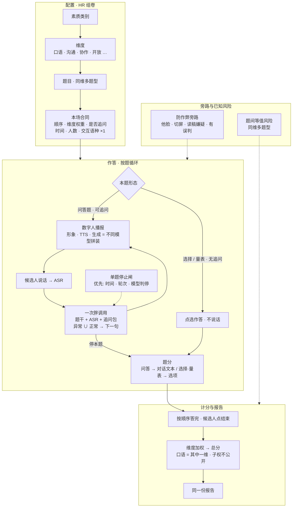

# AI interview session — system map (portfolio)

One-page **product context** for a voice-first AI interview: how a session is configured, how each item runs, and how scores become one report.

This is methodology shape only—**not** a vendor architecture claim, and **not** production prompts, weights, or KPI tables.

**Author role:** content / assessment design (item–dimension contract, spoken follow-up routing, stop gates, oral construct & composition shape). Not full-stack Agent / model / infra ownership.

**Depth elsewhere:**

- Dialogue **routing** (spoken Q&A follow-ups): [ai-interview-decision-map](https://github.com/yuanlin-82/ai-interview-decision-map)
- **Oral ability** constructs: [english-speaking-assessment](https://github.com/yuanlin-82/english-speaking-assessment)

---

## Map

---

## How to read it

### 1. Configuration before the room opens

HR builds a session from **素质类别 → 维度 → 题目**. One dimension may hold several item types (spoken probe, MCQ, Likert-style scale, …). That flexibility creates a real measurement risk: **item equivalence within a dimension** is not automatic.

The session contract also locks: item order, dimension weights toward a total, whether spoken follow-up is on, time bounds, room capacity, and **one interaction language** for the whole session. Multilingual support here means *which language the interview is conducted in*—not the same construct as the **oral ability** dimension on the report.

### 2. Two item paths in the live loop

| Path | What happens | Follow-up? |
| --- | --- | --- |
| **Spoken Q&A** | Digital human speaks the stem / probe; candidate talks; ASR text feeds the model | Yes, when enabled |
| **Choice / scale** | Candidate selects; no speech | No—nothing to probe |

The digital human is an **announcer stack**, not one model: avatar / image drive, TTS, and follow-up generation are **separate models stitched together**.

Spoken follow-ups use a **single fat call**: stem + ASR + follow-up pack (abnormal recoveries and normal probes in one prompt) → one next utterance → TTS. Per-item **stop** priority: **time > rounds > model stop judgment** (stop is per item, not whole-session orchestration).

### 3. Scoring and the report

- Open items: score from **dialogue text**.  
- Choice / scale: score from **selected option(s)**.  
- Each item is scored on its own; **dimension-weighted total and the report appear only after a normal session end**: candidate finishes the HR-ordered bank and clicks end.  
- **Oral ability** is one report dimension among others (e.g. communication, teamwork, openness). Sub-dimension weights inside oral are **not** published here.

### 4. Side paths (do not over-read as ability)

Anti-cheat watches signals such as another face in frame, screen switching, and “reading a script” suspicion (keyboard noise, long pre-answer silence, AI-like content). These are **operational alerts with known false-positive risk**, not a claim that they cleanly measure competency.

---

## What this page deliberately omits

Production prompts, exact weight tables, vendor names, raw audio/video, customer stems, and KPI dashboards. See also the NOTICE files in the methodology repos.
